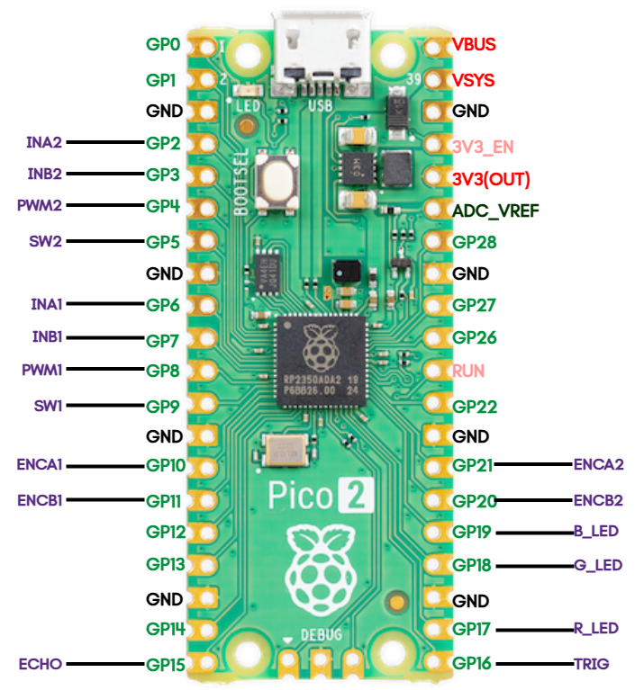

=================
Pico Wiring Guide
=================
We use Raspberry Pi Pico2 to interact with a handful of peripheral devices.
As the 1st gen microcontroller has the same pin layout, you shouldn't have any issues to use a Pico1.

